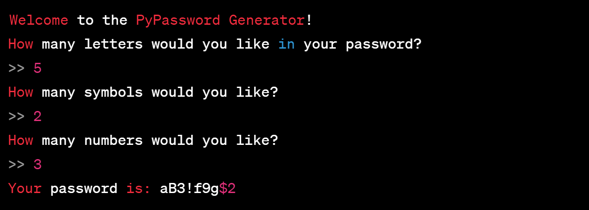

# PyPassword Generator README

## Overview

The PyPassword Generator is a simple and efficient tool for generating random passwords. By combining letters, symbols, and numbers, it creates strong and secure passwords suitable for various online accounts.

## Features

- Customizable Password Length: Users can specify the number of letters, symbols, and numbers in the password.
- Diverse Character Set: Includes lowercase and uppercase letters, digits, and special symbols for comprehensive password strength.
- Randomized Order: The elements of the password are shuffled to enhance security.

## How to Use

- Run the Program: Start the program in a Python environment.
- Input Preferences:
  - Enter the desired number of letters in the password.
  - Specify the number of symbols to include.
  - Choose the number of numbers to be part of the password.
- Receive Password: The program will display the generated password.

## Requirements

- Python 3.x

## Example

## Disclaimer

- This tool is for educational purposes. The security of the generated passwords depends on various factors including length and complexity.
- Users are responsible for the safekeeping of their passwords.

